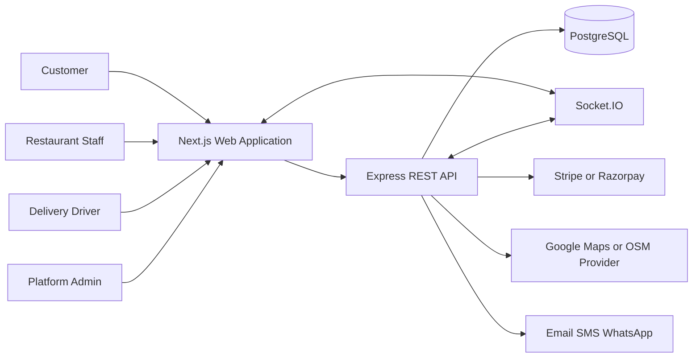
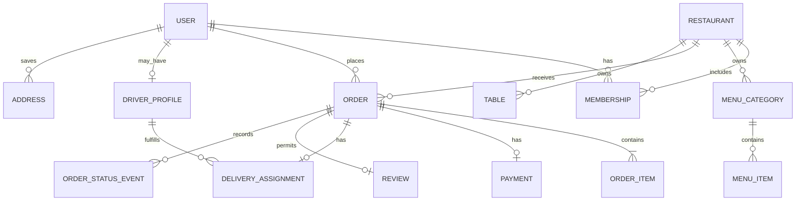
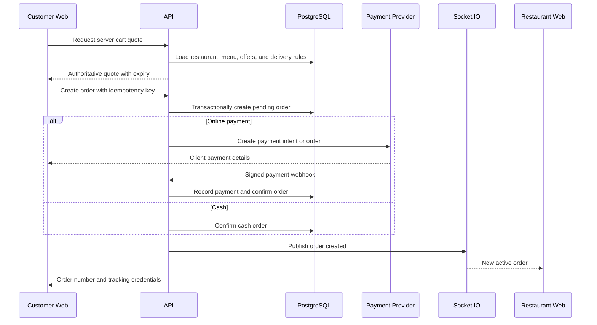
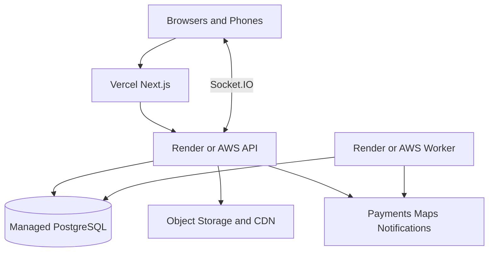

# Al-Arab Platform Architecture

## Document Status

**Version:** 1.0
**Status:** Target architecture for Phase 1
**Related document:** [PRD.md](./PRD.md)
**Repository:** TypeScript monorepo using `apps/web` and `apps/api`

## 1. Purpose

This document defines the technical architecture for the Al-Arab food ordering and delivery platform. It covers customer, restaurant, delivery-driver, and platform-administrator experiences in one responsive web application backed by a dedicated API and relational database.

The repository already contains a working single-restaurant application. The target architecture extends that system into a local multi-restaurant platform without requiring a disruptive rewrite.

## 2. Architecture Principles

- Keep one deployable web client and one deployable API during Phase 1.
- Enforce role permissions and restaurant tenancy in the API.
- Treat server-side prices, payments, order states, and delivery eligibility as authoritative.
- Keep external services behind provider interfaces.
- Use asynchronous real-time events to improve UX, not as the only source of truth.
- Design for mobile networks, temporary disconnections, retries, and duplicate requests.
- Prefer incremental migration over replacing working features at once.
- Keep modules aligned with business domains rather than UI pages.
- Store financial and order data in a relational database with transactional guarantees.

## 3. Current and Target Technology

| Concern | Current repository | Phase 1 target |
| --- | --- | --- |
| Frontend | Next.js 15, React 19, Tailwind CSS | Retain and extend |
| Routing | Next.js App Router | Retain with role route groups and guards |
| Client state | Zustand and React Query | Retain; separate server and client state clearly |
| API | Express REST API | Retain REST for Phase 1 |
| Validation | Zod and controller validation | Standardize Zod request and response contracts |
| Authentication | JWT, refresh tokens, Google-ready routes | Retain server-owned JWT and add OAuth providers |
| Database | MongoDB/Mongoose with local JSON demo stores | PostgreSQL with Prisma ORM |
| Payments | Razorpay and cash | Payment adapter supporting Stripe or Razorpay |
| Maps | Leaflet and OpenStreetMap | Map adapter; Google Maps may be configured for routes and ETA |
| Real time | Socket.IO | Retain with authenticated rooms and polling fallback |
| Hosting | Local development | Vercel for web; Render or AWS for API, PostgreSQL, and workers |

## 4. System Context



All user roles access one web application. Route groups and server-provided permissions determine the available interface. The browser never connects directly to the database or uses secret integration credentials.

## 5. Container Architecture

### Web Application

Responsibilities:

- Render customer, restaurant, driver, and platform-admin interfaces.
- Manage navigation, forms, accessible interactions, and responsive layouts.
- Store temporary UI state and a persistent single-restaurant cart.
- Fetch and cache API data through React Query.
- Open authenticated Socket.IO subscriptions.
- Request browser geolocation only after clear user action.
- Never calculate authoritative order totals or grant permissions.

### API Application

Responsibilities:

- Authenticate users and resolve roles and restaurant memberships.
- Validate all request data.
- Enforce restaurant tenancy and resource ownership.
- Own menu, pricing, checkout, order, assignment, review, and support rules.
- Create payment sessions and validate provider webhooks.
- Persist relational data through Prisma.
- Publish real-time domain events after successful database commits.
- Integrate with maps and notification providers.

### PostgreSQL Database

Responsibilities:

- Store users, roles, restaurants, menus, orders, payments, assignments, and reviews.
- Enforce foreign keys, uniqueness, required relationships, and transaction integrity.
- Support tenant-scoped indexes and reporting queries.
- Preserve immutable financial references and audit records.

### Background Worker

The worker can begin as a process inside the API deployment and become a separate deployable when volume requires it.

Responsibilities:

- Send email, SMS, and WhatsApp notifications.
- Retry transient integration failures.
- Process payment-webhook follow-up work.
- Expire stale carts, sessions, and driver-location records.
- Generate scheduled reports.

Phase 1 can use a PostgreSQL-backed job table. Redis and a dedicated queue are optional scaling additions.

## 6. Architecture Decisions

### REST Instead of GraphQL for Phase 1

The current API is RESTful and its operations map naturally to domain commands and resources. REST avoids adding another transport layer during the PostgreSQL migration. GraphQL can be reconsidered only if client data-composition requirements justify it.

### Express Instead of Next.js Route Handlers for Core APIs

The existing Express API already owns authentication, orders, payments, reports, support, and Socket.IO. Keeping it separate allows independent scaling, long-lived socket connections, webhook processing, and background work.

Next.js route handlers remain appropriate for small web-specific proxies such as public geocoding calls that should not expose provider details.

### Server-Owned JWT Authentication

The API remains the identity authority because all roles use the same backend and Socket.IO needs the same session model. Google OAuth can be added through the existing API login exchange. NextAuth may be used only as a web-facing OAuth helper if it exchanges identity with the API rather than creating a second authorization system. Firebase Auth is not required for Phase 1.

### PostgreSQL and Prisma

Orders, payments, memberships, assignments, and reviews have strong relationships and transaction boundaries. PostgreSQL provides relational integrity, while Prisma provides typed queries, migrations, and transactional operations.

### Provider Adapters

Payment, maps, object storage, and notification services use application interfaces. Business services depend on those interfaces rather than Stripe, Razorpay, Google Maps, or Twilio directly.

## 7. Target Monorepo Structure

The existing workspace names are retained to avoid unnecessary path churn.

```text
food delivery/
|-- apps/
|   |-- web/                         # Next.js frontend
|   |   |-- app/
|   |   |   |-- (customer)/          # Customer route group
|   |   |   |-- restaurant/          # Restaurant staff routes
|   |   |   |-- driver/              # Driver routes
|   |   |   |-- admin/               # Platform-admin routes
|   |   |   |-- api/                 # Web-only proxy routes
|   |   |   `-- layout.tsx
|   |   |-- components/
|   |   |   |-- customer/
|   |   |   |-- restaurant/
|   |   |   |-- driver/
|   |   |   |-- admin/
|   |   |   `-- ui/
|   |   |-- hooks/
|   |   |-- lib/                      # API client, sessions, formatters
|   |   |-- store/                    # Zustand client state
|   |   `-- public/
|   |
|   `-- api/                          # Express backend
|       |-- prisma/
|       |   |-- schema.prisma
|       |   |-- migrations/
|       |   `-- seed.ts
|       |-- src/
|       |   |-- config/
|       |   |-- middleware/
|       |   |-- modules/
|       |   |   |-- auth/
|       |   |   |-- restaurants/
|       |   |   |-- menus/
|       |   |   |-- carts/
|       |   |   |-- orders/
|       |   |   |-- payments/
|       |   |   |-- deliveries/
|       |   |   |-- reviews/
|       |   |   |-- support/
|       |   |   `-- reports/
|       |   |-- integrations/
|       |   |   |-- maps/
|       |   |   |-- payments/
|       |   |   |-- notifications/
|       |   |   `-- storage/
|       |   |-- realtime/
|       |   |-- jobs/
|       |   `-- server.ts
|       `-- tests/
|
|-- packages/
|   |-- contracts/                    # Shared Zod schemas and DTO types
|   |-- config/                       # Shared TypeScript and lint config
|   `-- test-utils/                   # Fixtures and integration helpers
|
|-- docs/
|-- PRD.md
|-- Architecture.md
|-- .env.example
`-- package.json
```

The target structure is evolutionary. Existing controllers, routes, models, and services should move into domain modules only when touched by Phase 1 work.

## 8. Frontend Architecture

### Route Boundaries

Suggested route ownership:

| Route | Audience | Purpose |
| --- | --- | --- |
| `/` | Public/customer | Location and restaurant discovery |
| `/restaurants/[restaurantId]` | Public/customer | Restaurant details and menu |
| `/cart` | Customer | Restaurant-scoped cart |
| `/checkout` | Customer | Address, payment, and order confirmation |
| `/orders` | Customer | Order history |
| `/orders/[orderNumber]` | Customer | Tracking and receipt |
| `/restaurant/*` | Restaurant staff | Orders, kitchen, menus, drivers, reports, settings |
| `/driver/*` | Delivery drivers | Availability, assignments, navigation, history |
| `/admin/*` | Platform admins | Restaurants, users, payments, support, analytics |

Existing public compatibility routes such as `/mobile`, `/menu`, and table QR query parameters remain supported during migration.

### State Ownership

- **React Query:** API-backed server state, caching, refetching, and mutations.
- **Zustand:** cart, local preferences, temporary table session, and small cross-route UI state.
- **Component state:** dialog visibility, form drafts, and local interactions.
- **URL state:** restaurant search, filters, sorting, pagination, and shareable selections.
- **Server state only:** roles, order status, menu prices, payment status, and delivery assignment.

### API Client

All browser requests route through a shared typed API client. The client must:

- Derive localhost or private-LAN API origins during development.
- Use production environment URLs when configured.
- Send credentials only to approved origins.
- Perform one coordinated refresh-token retry.
- Normalize API errors into a common structure.
- Cancel stale restaurant-search and location-search requests.

### Rendering Strategy

- Server-render public discovery and restaurant pages when practical for performance and indexing.
- Use client components for cart, checkout, maps, QR scanning, dashboards, and real-time tracking.
- Dynamically load Leaflet, QR scanning, charts, and other browser-only modules.
- Keep role dashboards behind authenticated layouts.

## 9. Backend Module Design

Each domain module should contain its route, controller, validation schema, service, repository, and tests.

```text
modules/orders/
|-- order.routes.ts
|-- order.controller.ts
|-- order.schemas.ts
|-- order.service.ts
|-- order.repository.ts
|-- order.events.ts
`-- order.test.ts
```

### Layer Responsibilities

- **Routes:** HTTP method, path, middleware, and controller binding.
- **Controllers:** Translate HTTP input and output; no core business logic.
- **Schemas:** Validate params, query strings, and bodies with Zod.
- **Services:** Execute business use cases and transaction boundaries.
- **Repositories:** Isolate Prisma queries and tenant scoping.
- **Integrations:** Implement external provider interfaces.
- **Events:** Publish committed domain changes to Socket.IO and jobs.

## 10. Relational Data Architecture

### Core Relationships



### Required Tenant Keys

These records must include `restaurantId`:

- Membership
- MenuCategory
- MenuItem
- Table
- Order
- Payment or an immutable restaurant reference through Order
- DeliveryAssignment
- RestaurantSettings
- PromoCode
- Review
- RestaurantReportSnapshot

Repositories require a tenant context for restaurant-owned operations. A route parameter alone is never sufficient authorization.

### Important Constraints

- User email and verified phone are unique after normalization.
- Restaurant slug is unique.
- A menu item belongs to exactly one restaurant.
- A cart contains items from one restaurant only.
- Order numbers are globally unique or restaurant-prefixed and unique.
- Order items store immutable name, customization, quantity, unit price, and tax snapshots.
- A payment-provider reference is unique.
- A delivery assignment has one active driver at a time.
- A customer can submit at most one review per completed order.
- Table numbers are unique within a restaurant.
- Private QR tokens are unique and stored as hashes where practical.

### Monetary Values

Store monetary values as integer minor units, such as paise, never floating-point numbers. Every order persists subtotal, discount, tax, delivery fee, tip, and total snapshots.

### Transactions

Use Prisma transactions for:

- Creating an order from a validated quote.
- Reserving or decrementing constrained inventory when introduced.
- Recording payment success and transitioning order payment state.
- Assigning or reassigning a driver.
- Completing an order and enabling its review.
- Processing refunds and financial ledger entries.

## 11. API Design

### Conventions

- Base path: `/api/v1` for new multi-restaurant endpoints.
- JSON request and response bodies.
- ISO 8601 UTC timestamps.
- Integer minor units for money.
- Cursor pagination for large operational lists; page pagination is acceptable for static admin reports.
- Idempotency key required for order creation, payment-session creation, and refunds.
- Stable error envelope with code, message, field errors, and request ID.

Example error:

```json
{
  "error": {
    "code": "DELIVERY_OUTSIDE_ZONE",
    "message": "The selected address is outside this restaurant's delivery area.",
    "requestId": "req_01J...",
    "fields": []
  }
}
```

### Main Endpoint Groups

```text
/api/v1/auth/*
/api/v1/restaurants/*
/api/v1/restaurants/:restaurantId/menu
/api/v1/restaurants/:restaurantId/orders
/api/v1/cart/quote
/api/v1/orders/*
/api/v1/payments/*
/api/v1/deliveries/*
/api/v1/reviews/*
/api/v1/support/*
/api/v1/admin/*
```

Existing `/api/*` routes remain available during migration and can internally call the same services.

## 12. Authentication and Authorization

### Token Model

- Access token: short-lived JWT, approximately 10 to 15 minutes.
- Refresh token: opaque or signed rotating token stored in a secure, HTTP-only, SameSite cookie.
- Refresh-token family: persisted server-side for rotation, reuse detection, and revocation.
- OAuth: provider identity is exchanged for an internal user and the same platform session.
- Socket authentication: access token validated during connection and refreshed through the HTTP flow.

### Authorization Model

Use role-based access control plus resource ownership:

- Platform role: `CUSTOMER`, `DRIVER`, or `PLATFORM_ADMIN`.
- Restaurant membership role: `OWNER`, `MANAGER`, `KITCHEN`, or `ORDER_STAFF`.
- Resource check: restaurant membership, customer ownership, driver assignment, or support assignment.

Authorization helpers should answer explicit questions such as:

- Can this user update this restaurant's menu?
- Can this driver read this delivery assignment?
- Can this customer track this order?
- Can this administrator suspend this restaurant?

### Security Controls

- Password hashing with bcrypt or Argon2.
- Rate limits for login, OTP, refresh, support, and checkout endpoints.
- Secure cookies and strict CORS allowlists.
- Helmet and request-size limits.
- Zod validation before service execution.
- Payment-webhook signature verification using raw request bodies.
- Audit logs for role changes, suspensions, refunds, settings, and manual order changes.
- Secrets only in server environment variables or a managed secret store.

## 13. Ordering Flow



The server always recalculates the quote. Browser totals are display-only.

## 14. Order State Machines

### Delivery

```text
PLACED -> ACCEPTED -> PREPARING -> READY_FOR_PICKUP
       -> OUT_FOR_DELIVERY -> DELIVERED
```

### Dine-in

```text
PENDING -> PREPARING -> READY -> SERVED
```

### Pickup

```text
PLACED -> ACCEPTED -> PREPARING -> READY_FOR_PICKUP -> COLLECTED
```

`CANCELLED` is permitted only from configured pre-terminal states. Services validate transitions; clients only request them.

Every transition creates an `OrderStatusEvent` with actor, previous state, next state, timestamp, and optional reason.

## 15. Real-Time Architecture

### Socket Rooms

```text
user:{userId}
restaurant:{restaurantId}
order:{orderId}
driver:{driverId}
support:{issueId}
admin:platform
```

Joining a room requires server authorization. Clients cannot join arbitrary restaurant or order rooms.

### Events

```text
order.created
order.updated
order.assigned
order.location.updated
payment.updated
restaurant.status.updated
support.message.created
```

Events contain identifiers and safe display data, never full private records or secrets.

### Reliability

- Persist the database change before emitting an event.
- Re-fetch authoritative state after reconnect.
- Use React Query invalidation when receiving events.
- Poll active orders as a fallback when sockets disconnect.
- Add a transactional outbox before horizontally scaling event delivery.

## 16. Driver Location and ETA

- The driver explicitly enables location sharing for an active assignment.
- The driver client sends coordinates, accuracy, heading, speed, and timestamp at a controlled interval.
- The API validates assignment ownership, coordinate ranges, freshness, and update frequency.
- Store only the latest operational point plus limited tracking history when required for support.
- Share location only with the assigned restaurant, ordering customer, driver, and authorized administrators.
- Stop accepting and exposing updates after delivery, cancellation, or reassignment.
- ETA requests go through a map provider service and are cached briefly.
- When routing is unavailable, show status and last-update time instead of inventing an ETA.

For higher scale, location updates can move from PostgreSQL writes to Redis with periodic durable snapshots.

## 17. Integration Architecture

### Payments

```ts
interface PaymentProvider {
  createPayment(input: CreatePaymentInput): Promise<PaymentSession>;
  verifyWebhook(input: WebhookInput): Promise<PaymentEvent>;
  refund(input: RefundInput): Promise<RefundResult>;
}
```

Implementations:

- `StripePaymentProvider`
- `RazorpayPaymentProvider`
- `DemoPaymentProvider` for local development only

### Maps

```ts
interface MapsProvider {
  reverseGeocode(point: GeoPoint): Promise<AddressResult>;
  route(input: RouteInput): Promise<RouteResult>;
  estimateArrival(input: RouteInput): Promise<EtaResult>;
}
```

Leaflet remains the map renderer. OpenStreetMap or Google tiles and services can be selected according to licensing, cost, and production requirements.

### Notifications

```ts
interface NotificationProvider {
  send(message: NotificationMessage): Promise<DeliveryResult>;
}
```

Implement email, SMS, WhatsApp, and in-app channels separately. Notification failures must not roll back successfully placed orders.

## 18. Caching and Performance

- Cache public restaurant summaries and menus with short revalidation windows.
- Invalidate restaurant menu cache when availability or prices change.
- Use database indexes for tenant, status, created time, customer, driver, and restaurant queries.
- Avoid caching personalized order or payment data in shared caches.
- Debounce restaurant and location search requests.
- Lazy-load maps, QR scanners, charts, and dashboard-only modules.
- Use image optimization and an object-storage CDN for restaurant and menu media.

## 19. Observability

Every API request receives a request ID propagated into logs and integration calls.

Required telemetry:

- Structured server logs.
- API latency and error rate by route.
- Database query latency and connection usage.
- Socket connections, reconnects, and event failures.
- Payment creation, webhook, and reconciliation failures.
- Order funnel and status-transition timing.
- Driver location freshness and ETA-provider failures.
- Background-job retries and dead-letter jobs.

Production exceptions should be sent to an error-tracking service. Health endpoints should separately report process liveness and dependency readiness.

## 20. Deployment Architecture

### Recommended Initial Deployment



### Environments

- **Local:** Next.js `3000`, Express `5000`, local PostgreSQL or managed development database.
- **Preview:** Vercel preview plus isolated API and database where practical.
- **Staging:** Production-like integrations in test mode.
- **Production:** Managed PostgreSQL, HTTPS, strict CORS, production secrets, backups, and monitoring.

### Hosting Notes

- Socket.IO requires a host that supports persistent connections; do not host the Express socket server as short-lived serverless functions.
- If API instances scale horizontally, use sticky connections plus a Socket.IO Redis adapter or another shared event transport.
- PostgreSQL must use automated backups, point-in-time recovery, and encrypted connections.
- Database migrations run as a controlled deployment step before new code receives traffic.

## 21. Environment Variables

The implemented environment-variable inventory is maintained in
`docs/ENVIRONMENT_VARIABLE_AUDIT.md`, with copyable templates in
`apps/api/.env.production.example` and
`apps/web/.env.production.example`. This supersedes the earlier illustrative
PostgreSQL, Stripe, Google Maps, and Google OAuth variable names that were never
implemented in this application.

Only variables explicitly prefixed for public use may be exposed to the
browser. Payment secrets, database URLs, email-provider keys, OTP HMAC keys, and
JWT secrets must never be public.

## 22. PostgreSQL Migration Plan

The current MongoDB/Mongoose and local JSON paths should remain operational until each domain is migrated and verified.

### Step 1: Introduce Prisma

- Add Prisma and PostgreSQL configuration to `apps/api`.
- Create foundational User, Session, Restaurant, and Membership tables.
- Add migrations and deterministic seed data.
- Keep existing MongoDB reads active.

### Step 2: Migrate Identity and Tenancy

- Import users with normalized emails, phones, roles, and password hashes where compatible.
- Create restaurant memberships.
- Switch authentication and authorization to PostgreSQL.
- Verify refresh-token revocation and role boundaries.

### Step 3: Migrate Catalog and Settings

- Import menus, customizations, tables, and restaurant settings.
- Add restaurant identifiers to every catalog record.
- Compare old and new menu API responses before switching reads.

### Step 4: Migrate Orders and Payments

- Import historical orders and payment references.
- Preserve immutable order snapshots and original timestamps.
- Switch new order writes to PostgreSQL in a maintenance window or controlled cutover.
- Reconcile counts and totals before disabling old writes.

### Step 5: Migrate Operations

- Move drivers, delivery assignments, reviews, support, reports, and audit logs.
- Remove demo-store fallbacks from production configuration.
- Retain an archived export for rollback and audit purposes.

Avoid long-term dual writes because partial failures can create inconsistent financial records.

## 23. Testing Strategy

### Unit Tests

- Pricing, promo, tax, and delivery-fee rules.
- Delivery-radius evaluation.
- Order state transitions.
- Permission and tenant-policy functions.
- Provider adapters with mocked SDKs.

### Integration Tests

- Authentication and refresh-token rotation.
- Tenant-scoped restaurant and menu queries.
- Order creation within a Prisma transaction.
- Payment webhooks and idempotency.
- Driver assignment and location authorization.
- Review eligibility.

### End-to-End Tests

- Customer discovery through confirmed order.
- Online payment test flow and cash flow.
- Restaurant accepts and prepares an order.
- Driver receives, picks up, shares location, and completes delivery.
- Customer sees live status and submits a review.
- Dine-in table QR order.
- Platform admin suspends access.
- Mobile layouts at 320 px and common desktop widths.

### Release Gates

- Type checking passes for web and API.
- Production builds pass.
- Prisma migrations apply to a clean database and a staging snapshot.
- Critical integration and end-to-end tests pass.
- No unresolved high-severity security findings.
- Payment and webhook reconciliation succeeds in provider test mode.

## 24. Evolution Triggers

Consider additional infrastructure only when measurements justify it:

- Add Redis when rate limiting, socket fan-out, location updates, or caching require shared low-latency state.
- Add a dedicated queue when background work needs durable retries at meaningful volume.
- Split services only when one domain has independent scaling or ownership needs.
- Add read replicas when reporting affects transactional database latency.
- Add a search engine when PostgreSQL full-text and indexed filters no longer meet discovery latency targets.

The Phase 1 architecture is intentionally a modular monolith. It provides strong boundaries without the operational cost of premature microservices.
